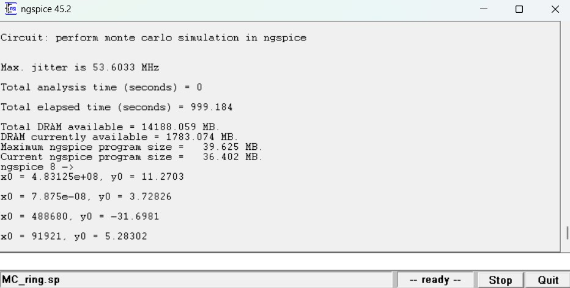
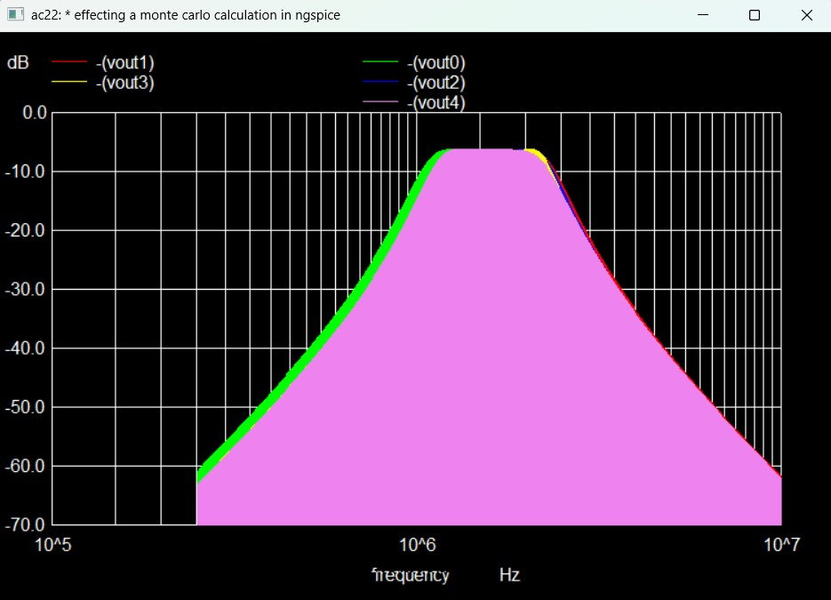
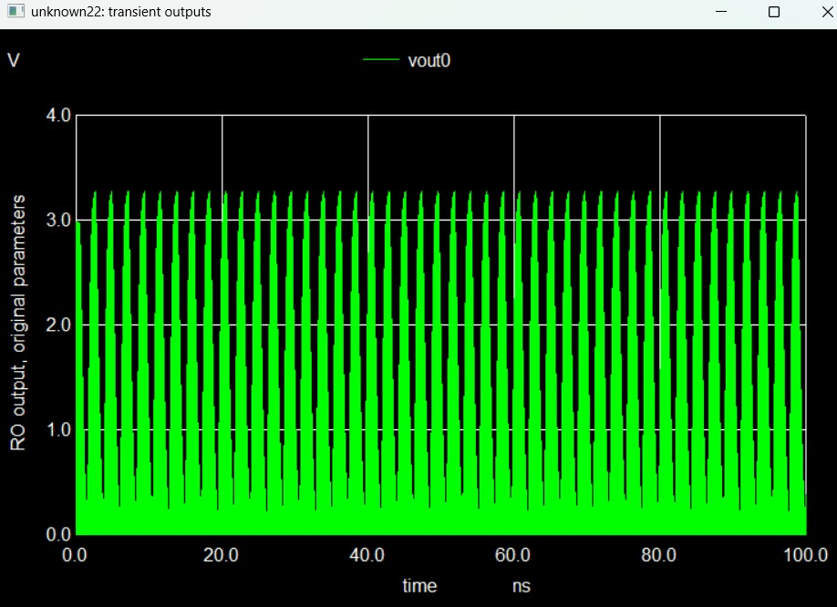
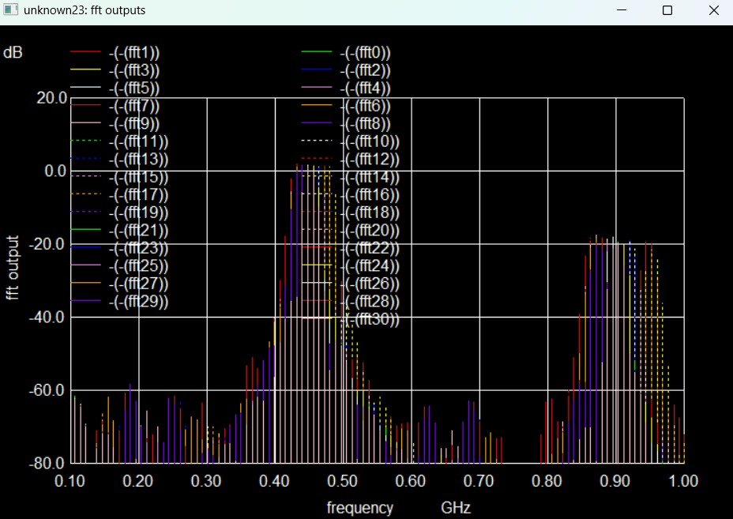
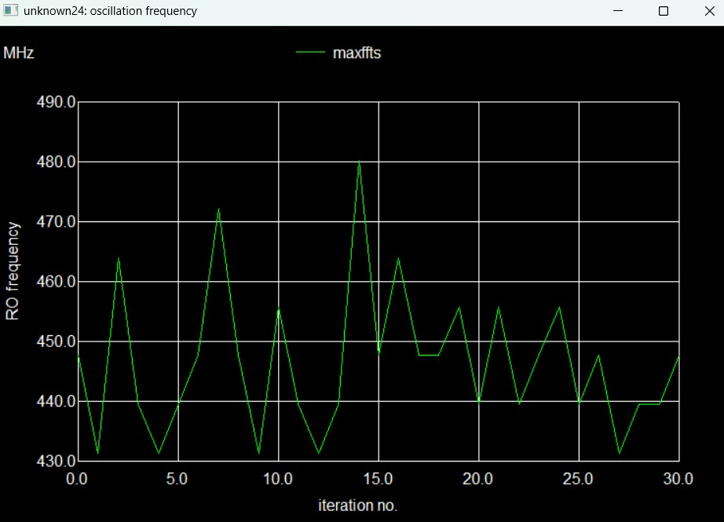

# Monte Carlo Walkthrough

This directory contains several ngspice examples, but this walkthrough focuses only on `MonteCarlo.sp`, `MC_ring.sp`, and `mc_ring_lib_complete_actual.cir`. `MonteCarlo.sp` is the compact passive-network example that measures how randomized L/C values shift the AC response and the `-10 dB` bandwidth. `MC_ring.sp` is the self-contained 25-stage ring-oscillator example that measures transient startup, FFT peak location, and run-to-run oscillation spread. `mc_ring_lib_complete_actual.cir` is the library-oriented version of the same ring-oscillator study, intended for swapping in PDK or foundry models while keeping the same measurement flow.

## `MonteCarlo.sp`

`MonteCarlo.sp` perturbs `C1`, `L1`, `C2`, `L2`, and `L3` with uniform variation and flips `C3` with a limit-style random choice before running an AC sweep from `250 kHz` to `10 MHz`. Its main stored result is the set of response curves plus the measured `bw` vector, which captures the `-10 dB` bandwidth for each Monte Carlo run.

Before looking at the figure, the quantity to watch is the frequency response of `V(out)` across repeated randomized runs. The point of this measurement is to see how much the passband shape and cutoff points move once the reactive parts are perturbed, because the script later measures bandwidth from those same curves.

The plot shows five overlaid AC magnitude traces with a similar band-pass shape but visibly shifted edges and peak locations. The central response stays broadly consistent while the lower and upper cutoff frequencies move from run to run, which is exactly the variation that `MonteCarlo.sp` captures in its measured bandwidth results.

## `MC_ring.sp`

`MC_ring.sp` builds a 25-stage inverter ring oscillator, saves the buffered output node `buf`, and then repeats transient and FFT analysis while statistically varying `vth0`, `u0`, `tox`, `lint`, and `wint` for both the NMOS and PMOS models. The script stores nominal and Monte Carlo waveforms, extracts the dominant FFT peak for each run, and computes a simple jitter metric from the spread of the `-40 dB` crossing points.

Before looking at the waveform plots, it helps to start with the run summary. This measurement is not a separate electrical quantity by itself; it is the control-script checkpoint that tells us whether the Monte Carlo loop completed and what high-level spread metric ngspice reported after processing the transient and FFT data.

The console window shows that the run completed and reports a maximum jitter of about `53.6 MHz` for the dataset in the screenshot. The extra numeric lines at the bottom are cursor readouts from interactive plotting, so the main takeaway here is that the control flow finished successfully and produced the summary statistics that the later plots visualize.

Before this next figure, the measurement of interest is the nominal time-domain oscillator output. `MC_ring.sp` first records the baseline transient waveform for run `0`, which provides the reference switching behavior before comparing how randomized model parameters shift the oscillator frequency.

The waveform shows a steady oscillation at the buffered output with swing close to the `3.3 V` supply rails after startup. In practical terms, this confirms that the ring oscillator is behaving correctly in the nominal case and gives a clean baseline waveform for the later spectral and frequency-spread measurements.

Before the FFT figure, the measurement to focus on is the dominant oscillation frequency of each Monte Carlo run. After each transient analysis, the script linearizes `buf`, computes an FFT, and searches for the strongest spectral component over the expected oscillator band.

The overlaid FFT traces cluster around a main peak in roughly the `0.4 GHz` to `0.5 GHz` range, with a second cluster at the higher harmonic near roughly `0.85 GHz` to `0.95 GHz`. The horizontal spread of the tallest peaks is the visible signature of process-driven variation in oscillation frequency from one run to the next.

Before the final ring-oscillator figure, the measurement is the extracted dominant frequency itself, stored in the `maxffts` vector and plotted against iteration number. This condenses the FFT results into a simple run-by-run summary so it is easier to see the Monte Carlo spread without reading every spectrum individually.

The line plot shows the oscillator landing mostly in the low-to-mid `400 MHz` range, with visible excursions from about `431 MHz` up to about `480 MHz`. That spread is consistent with the FFT overlay and gives a compact picture of how much the randomized device parameters move the oscillation frequency across the full Monte Carlo sweep.

## `mc_ring_lib_complete_actual.cir`

`mc_ring_lib_complete_actual.cir` is the library-aware counterpart to `MC_ring.sp`. It keeps the same 25-stage ring-oscillator structure and the same transient, FFT, and oscillation-frequency measurement pattern, but it is arranged so you can replace the example devices with `.lib`-based foundry models or fall back to the built-in BSIM3 `agauss` threshold-voltage variation. In other words, `MC_ring.sp` is the self-contained demonstration, while `mc_ring_lib_complete_actual.cir` is the version you would adapt when moving the same walkthrough into a real PDK-backed environment.
